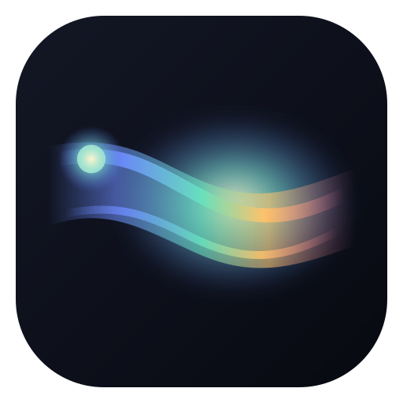
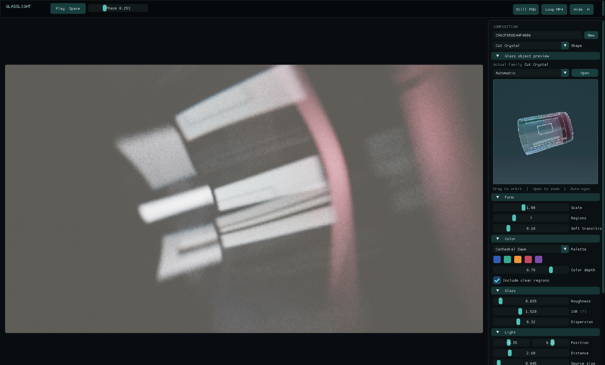
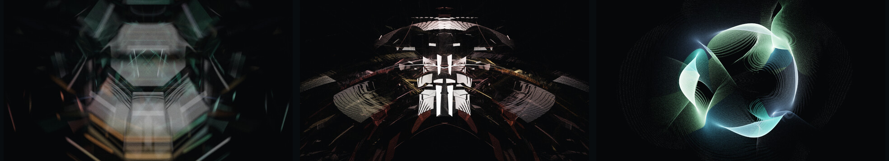

<p align="center">
  
</p>

<h1 align="center">GlassLight</h1>

<p align="center">
  <strong>Shape light through invisible procedural glass.</strong><br>
  A native, seed-driven generative art studio for Windows and Linux.
</p>



GlassLight traces light through procedural glass forms and renders only the
colored caustics that reach the wall. Every composition is reproducible, the
art controls update the live canvas, and exports contain the artwork without
the interface.

<p align="center">
  <a href="https://github.com/MagnusPetursson/GlassLight/releases/latest"><strong>Download the latest release</strong></a>
  · Windows / Linux x64 · Vulkan 1.2 · MIT
</p>

## Create with light

- Explore six seeded glass families: Pebble, Lens, Ribbon, Faceted Vessel,
  Cut Crystal, and Fracture.
- Shape the form, palette, material, light source, wall, and motion while the
  Vulkan renderer updates the canvas.
- Inspect the invisible glass itself in an orbitable preview with optional edge
  overlays.
- Export high-resolution PNG artwork with its complete composition embedded,
  then restore those settings later by opening the PNG in GlassLight.
- Render a deterministic, seamless H.264 MP4 loop of one full rotation.

### See it move


This preview slows the exported rotation for easier viewing.



<p align="center">
  <a href="docs/images/Cathedral_Faceted.png">Cathedral / Faceted Vessel (4K)</a>
  · <a href="docs/images/Ember_Cut_Crystal.png">Ember / Cut Crystal</a>
  · <a href="docs/images/Tidal_Ribbon.png">Tidal / Ribbon</a>
</p>

## Install

Download the package for your platform from the
[latest release](https://github.com/MagnusPetursson/GlassLight/releases/latest).

### Windows

Download `GlassLight-*-windows-x64.zip`, extract the whole folder, and run
`GlassLight.exe`. Keep the `shaders` folder beside the executable. Releases are
currently unsigned, so Windows may show a SmartScreen warning the first time
you open the app.

For MP4 export, place `ffmpeg.exe` beside `GlassLight.exe` or install FFmpeg on
`PATH`. PNG creation and restoration work without FFmpeg.

### AppImage

The AppImage is the simplest portable option. Make it executable and run it:

```sh
chmod +x GlassLight-*-x86_64.AppImage
./GlassLight-*-x86_64.AppImage
```

### Debian or Ubuntu

Install the downloaded Debian package with APT:

```sh
sudo apt install ./glasslight_*_amd64.deb
```

GlassLight requires a Vulkan 1.2-capable GPU with a current graphics driver.
FFmpeg is optional and is needed only for MP4 export.

## Make your first composition

1. Choose **Generate** or **New** to materialize a reproducible seed.
2. Select a glass family and adjust its form, color, material, light, and wall.
3. Pause the animation or scrub **Phase** to settle on a frame.
4. Choose **Still PNG** or **Loop MP4**. Use **Restore from PNG** to reopen an
   exported composition later.

Press <kbd>H</kbd> for an artwork-only view, <kbd>Space</kbd> to play or pause,
and <kbd>F11</kbd> for fullscreen.

## Build from source

GlassLight uses CMake 3.24+, Ninja, C++20, Vulkan 1.2, and
`glslangValidator`. On Linux Mint or Ubuntu:

```sh
sudo apt install cmake ninja-build g++ libvulkan-dev vulkan-tools glslang-tools
cmake --preset dev-linux
cmake --build --preset dev-linux
./build/dev-linux/glasslight
```

On Windows, use Visual Studio 2022 Build Tools, Ninja, and the LunarG Vulkan
SDK, then configure the x64 Native Tools terminal with:

```powershell
cmake --preset release-windows
cmake --build --preset release-windows
ctest --preset release-windows
```

SDL 3, Dear ImGui, Vulkan Memory Allocator, and JSON for Modern C++ are pinned
and fetched during configuration. See [Development](docs/DEVELOPMENT.md) for
the project layout, CLI, tests, GPU validation, benchmarks, and packaging.

## Platform and license

The current release targets Windows 10/11 x64 and Linux x86_64. A CPU/OpenGL
fallback, ARM64 packages, installers, automatic updates, and signed Windows
binaries are not included yet.

GlassLight is available under the [MIT License](LICENSE). Third-party licenses
are listed in [THIRD_PARTY_NOTICES.md](THIRD_PARTY_NOTICES.md).
